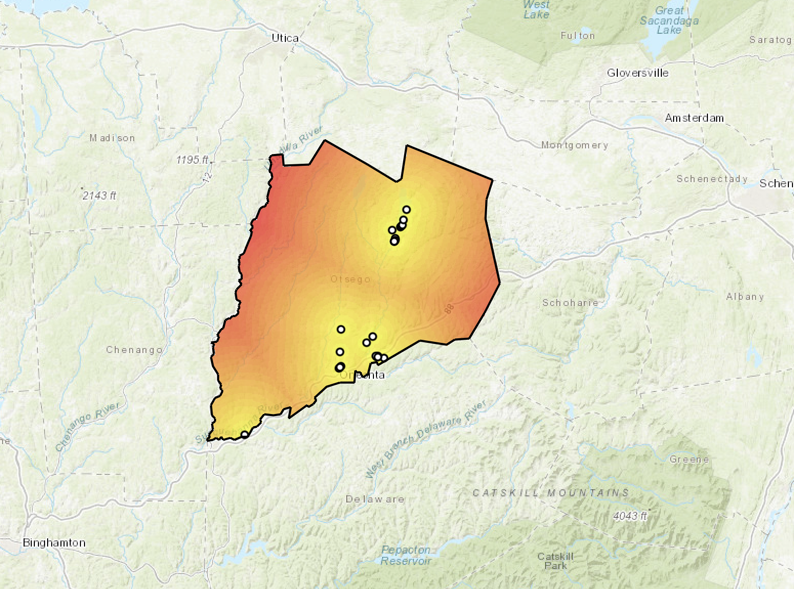

# Publications

## anadrofish: Anadromous fish population responses to dams

*Journal of Open Source Software, 2025*

<iframe src="pdfs/anadrofish.pdf" width="100%" height="600px">

</iframe>

------------------------------------------------------------------------

# Essays & Papers

## Age and growth relationships in species of Lepomis in Otsego Lake

SUNY Oneonta Biological Field Station Annual Report, 2024.

<iframe src="pdfs/age_and_growth.pdf" width="100%" height="600px">

</iframe>

## Density-Dependent Growth in Salmonids

Cumulative Project, Quantitative Biology, 2023.

<iframe src="pdfs/density_growth.pdf" width="100%" height="600px">

</iframe>

------------------------------------------------------------------------

## Interactive Projects

### Otsego County Hemlock Woolly Adelgid

[View Full Dashboard](https://sunyoneonta.maps.arcgis.com/apps/dashboards/03c7f210936a425f8bf2d0358774d81c)
